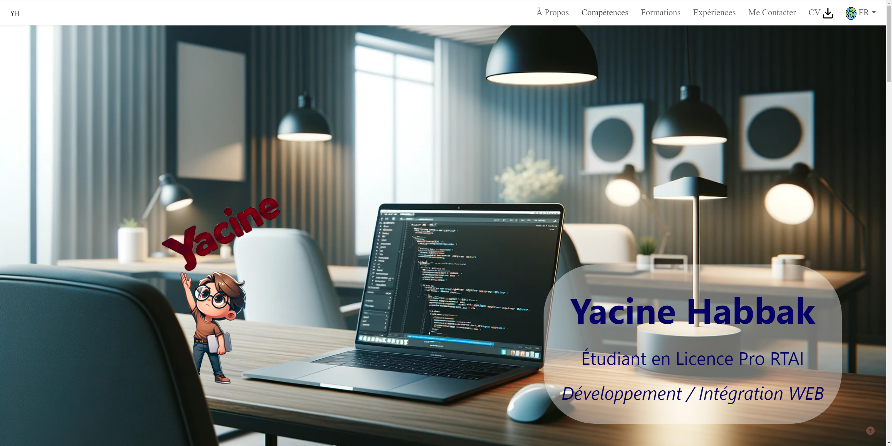
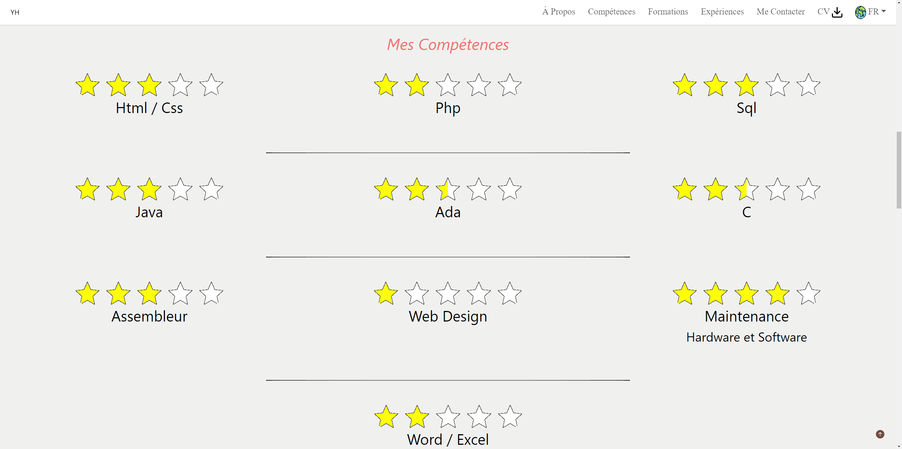
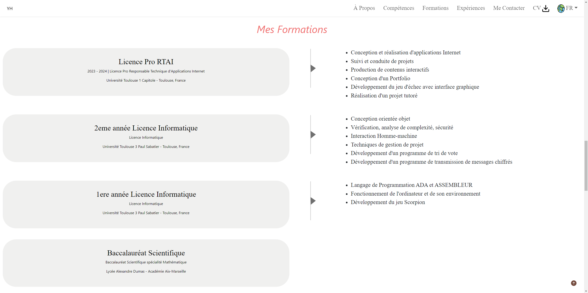

<h1>Présentation :</h1>
Site Web de mon portfolio en HTML/CSS/BOOTSTRAP (1er prototype)

<h1>Quelques pages du site :</h1>

<h2>Page d'Accueil</h2>

  

<h2>Page des Compétences</h2>

  

<h2>Page des Formations</h2>

  

